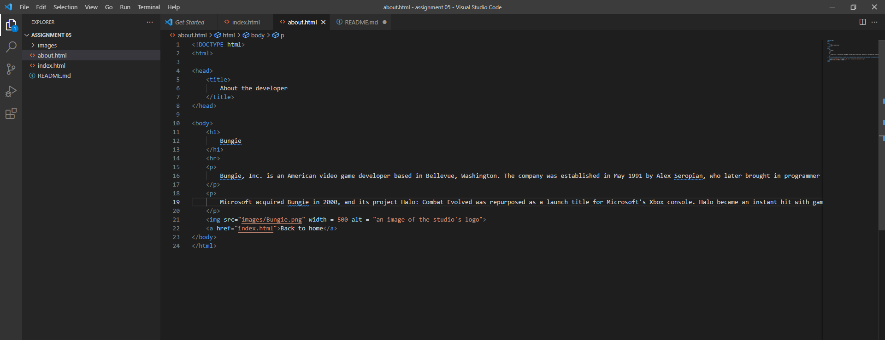

# Answers and screenshot

1. The website I visited using the wayback machine was Bungie.net from Dec 03 1998. The layout was very much a basic html website whereas now the website has multiple different sections you can go to, interactive elements, and a modern layout.
2. 