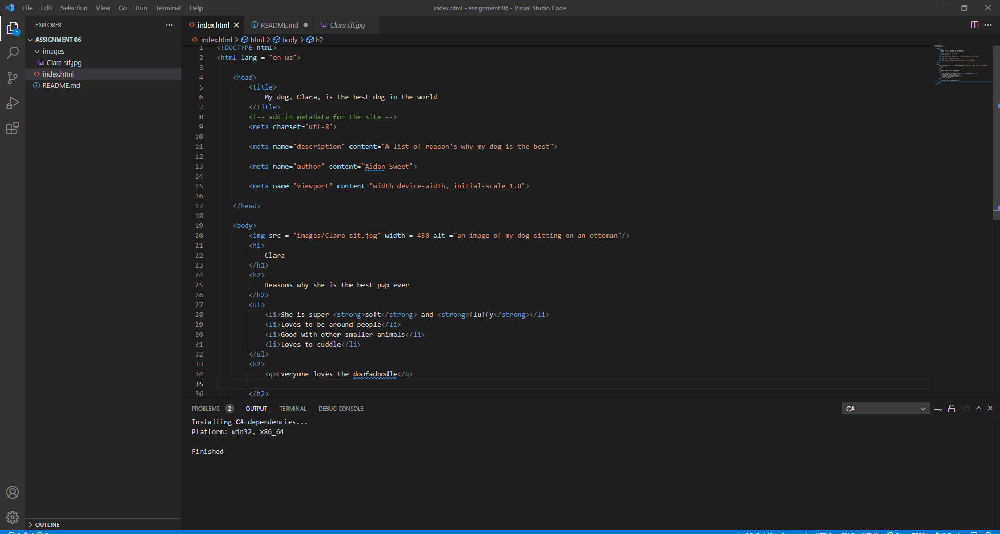

# Week 6 answers and screenshot

1.  Structural markdown is the information components within an HTML document. Elements such as headings, lists and paragraphs. Semantic markup reinforces the semantics, or meaning, of the information in webpages and web applications rather than merely to define its presentation or look. So where structural is the elements and information in an html page the semantic markdown is what describes all the elements 

2. 

