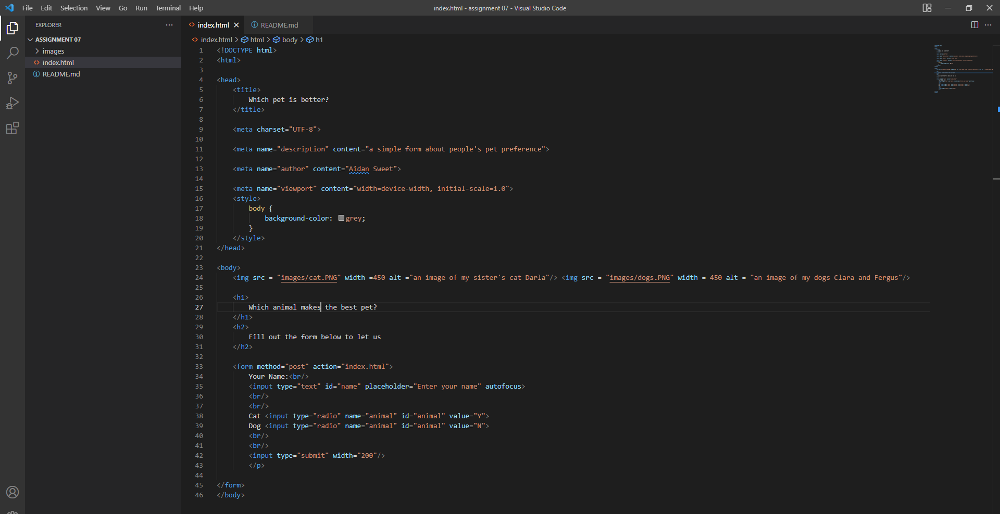

# Week 7 answer and screenshot

1. There are many different forms that I've come across online. Most frequently I'd say I come across forms for entering payment and shipping information when buying things on sites like Amazon or ordering food from a restaurant's website. Also entering log in info on many different sites.

2. 