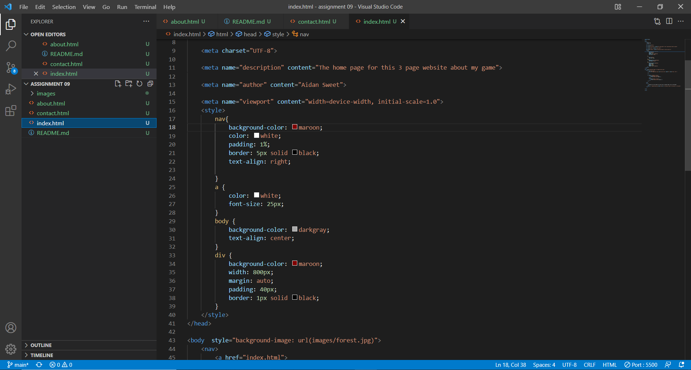

# Week 9 answer and screenshot

1. A lot of what we have learned this semester has been review for me as I learned the basics of CSS and HTML last school year in Cassen's Creative Coding 1 class. However, we didn't go super in depth about it and I didn't know things like meta data, div elements, or how to put videos into my websites.
2. Im really excited to jump into CSS as I wanna learn more and more about web design and how I can make better more modern looking and functional websites

3. 