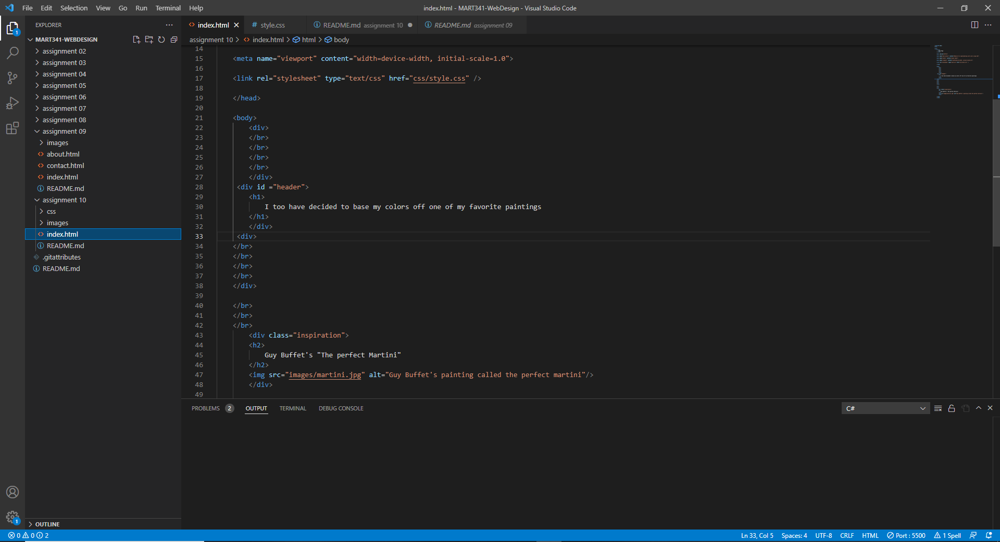

# Week 10 answers and screenshot

1. A universal style selector will apply the style change universally to every element within a page. an element style selector is used for applying style changes to a certain kind of element in a page like div tags or img tags. A class selector is attached to certain elements like a div tag and will style all the elements within that specific div tag and the class can be used across multiple tags. An Id style selector is used to make style changes the elements within and Id tag on a page and there can only be 1 of each ID tag in an html page. THe use of a style selector like an ID would be used if you wanted one specific element to have a different style from the rest of the page whereas if you wanted multiple elements on the page to have the same style you could use a class selector.

2. For my color pallet I put the image of the painting into a color pallet generator and used the colors of the painting to style my html page

3. 