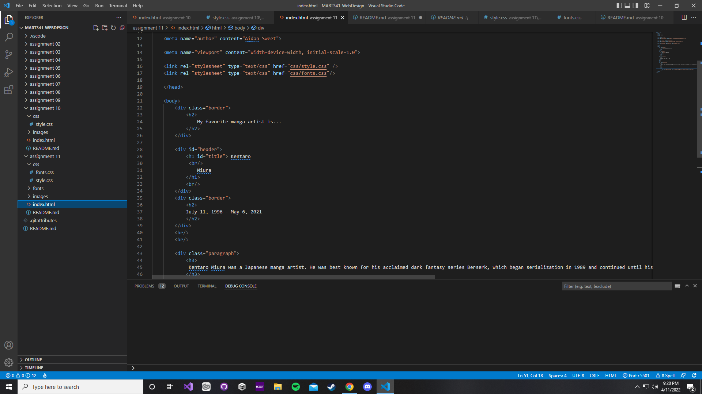

# Week 11 answers and screenshot

1. The art and technique of arranging text to make written language legible, readable, and pleasing to look at

2. Its important to have fallback fonts in case the browser cannot access the first font in the list it will then move on to the next one

3. System fonts are fonts that are installed on your computer, web fonts are fonts that are installed on an internet browser, and a web safe font is a font that can adapt to any browser on any device

4. 