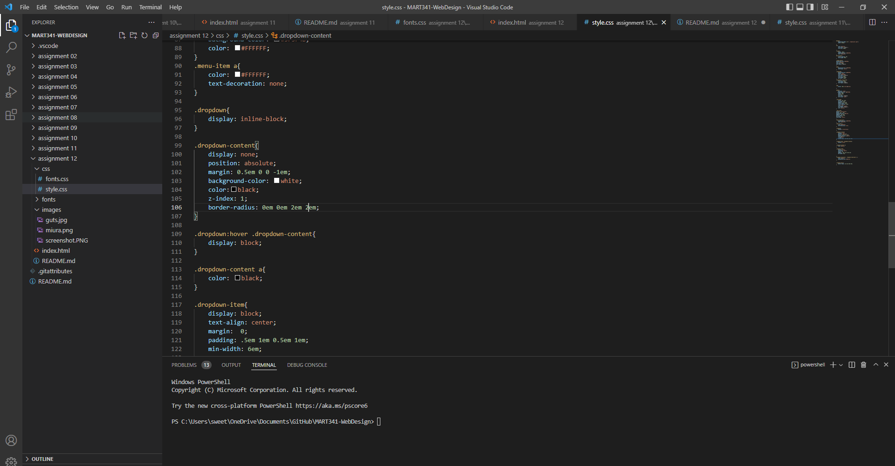

# Week 12 answers and screenshot

1. Padding is the space between the inner content of an element and the element itself. A margin is the space between and element and another element within the website. A border is a styled space that goes around the outside of an element within a page

2. I could not for the life of me get the second box in my dropdown menu to line up with the one on top of it. I tried messing with the margins and all that jazz but I could not get it to line up. 

3. 