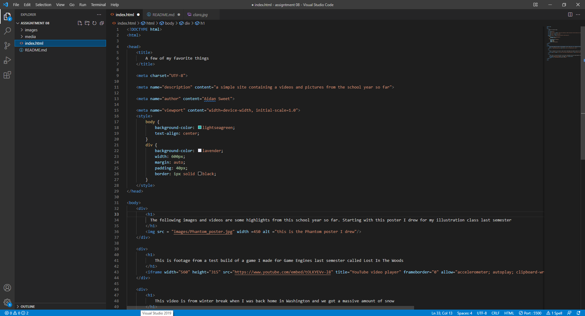

# Week 8 answer and screenshot

1. An affordance is all actions that are made possible by the properties of an object

2. Using a third party site for hosting videos like Youtube can save space by not having to have all the videos saved into your files. A downside though is that if the servers for the site goes down you now no longer have access to your videos

3. 